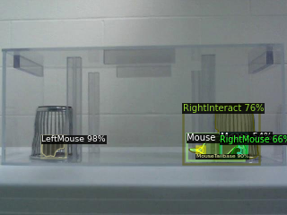
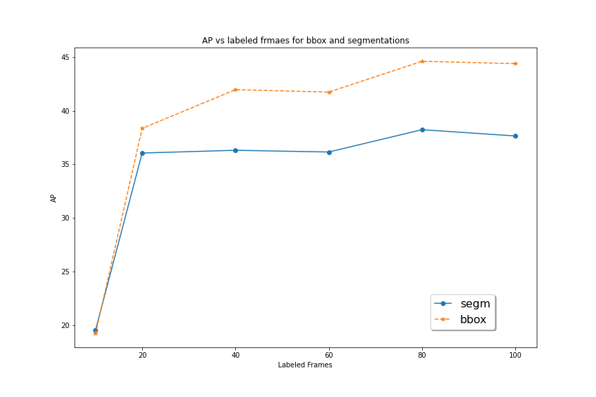

# annolid

[](https://github.com/healthonrails/annolid/actions)
[](https://github.com/healthonrails/annolid/actions)
[](https://zenodo.org/badge/latestdoi/290017987)


An annotation and instance segmentation-based multiple animal tracking and behavior analysis package.

## Overview of Annolid workflow


* Labeling of frames (annotation)
* COCO formatting
* Training and inference (local or Colab)
* Post-processing and analysis

## Annolid video tutorials

[](https://www.youtube.com/embed/videoseries?list=PLYp4D9Y-8_dRXPOtfGu48W5ENtfKn-Owc "Annolid Youtube playlist")

## User Guide

A basic user guide with installation instructions and recent documentation can be found at [](https://healthonrails.github.io/annolid/) https://healthonrails.github.io/annolid/.

## Examples


Instance segmentations             |  Behavior prediction
:-------------------------:|:-------------------------:
 | 

[](http://www.youtube.com/watch?v=op3A4_LuVj8 "Mouse behavior analysis with instance segmentation based deep learning networks")

## Local Installation

* Clone the code repo and change into the directory
```bash
git clone --recurse-submodules https://github.com/healthonrails/annolid.git
cd annolid
```

* Install the package with pip
```bash
pip install -e .
```
or with conda (recommended as this will install everything in a virtual environment)
```bash
conda env create -f environment.yml
```


Note: if you got this error:
`ERROR: Could not find a version that satisfies the requirement decord>=0.4.0`
try to install [ffmpeg](https://ffmpeg.org/) or you can install it in conda with `conda install -c conda-forge ffmpeg`.

FYI: it is helpful to compress videos to reduce diskspace using ffmpeg using `ffmpeg -i my_video.mp4 -vcodec libx264 my_video_compressed.mp4`

## Launch annolid user interface based on labelme
```bash
source activate annolid-env
annolid
#or you can provide a label.txt file as follows.
annolid --labels=/path/to/labels_custom.txt

```


If you want to learn more about labelme, please check the following link.

[Read more about annotations](annolid/annotation/labelme.md)


## How to label animals and behaviors?
### Polygons & keypoints(e.g. Vole_1, nose, tail_base, rearing…...)

* To train models for tracking animals and assigning IDs, please
label each instance with a unique name or ID (e.g. vole_1, mouse_2, or frog_femal_01).

* For instances without needing to assign IDs across different frames or videos, please label instances with a generic name or ID (e.g vole, mouse, or frog).

* For encoding behaviors, please name the ploygon with the behavior name (e.g. rearing, object_investigation, or grooming)

* For body parts, please use keypoint with names like nose, tail_base, or left_ear.

## How many frames do you need to label?

* 20 to 100 frames per video


* For autolabeling, you can label 20 frames and train a model. Then you can use the trained model to predict on the video and add the corrected predictions to the training set to train a better model. Repeat the process until the model is matching human performance.
  


## Tracking and re-identification

* To link instances across frames, we treat each instance as its own class across frames.
* To track multiple animals, label each animal as a separate instance.
* To generalize across animals or videos, label multiple animals as examples of the same instance.  

# Docker

Please make sure that [Docker](https://www.docker.com/) is installed on your system.
```
# on Linux
cd annolid/docker
docker build .
xhost +local:docker
docker run -it -v /tmp/.X11-unix:/tmp/.X11-unix/ -e DISPLAY=$DISPLAY  <Image ID>

```

# Citing Annolid
If you use Annolid in your research, please use the following BibTeX entry.
```
@misc{yang2020Annolid,
  author =       {Chen Yang, Jeremy Forest, Matthew Einhorn, Thomas Cleland},
  title =        {Annolid:  an instance segmentation-based multiple animal tracking and behavior analysis package},
  howpublished = {\url{https://github.com/healthonrails/annolid}},
  year =         {2020}
}
```
[For more information:](https://healthonrails.github.io/annolid/) https://healthonrails.github.io/annolid/
.

# SfN 2021 poster
[Annolid: an instance segmentation-based multiple-animal tracking
and behavior analysis package
](https://youtu.be/tVIE6vG9Gao)

# Datasets
**New** An example dataset annotated by Annolid and converted to COCO format dataset is now available from
this Google Drive link https://drive.google.com/file/d/1fUXCLnoJ5SwXg54mj0NBKGzidsV8ALVR/view?usp=sharing.

# Pretrained models
The pretrained models will be shared to the [Google Drive folder](https://drive.google.com/drive/folders/1t1eXxoSN2irKRBJ8I7i3LHkjdGev7whF?usp=sharing).

# Feature requests and bug reports

To request a new feature or report bugs, please use the link https://github.com/healthonrails/annolid/issues here.

# Annolid Google groups
[annolid@googlegroups.com](https://groups.google.com/g/annolid)