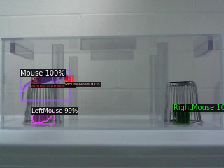

# annolid

[](https://github.com/healthonrails/annolid/actions)
[](https://github.com/healthonrails/annolid/actions)
[](https://zenodo.org/badge/latestdoi/290017987)


An annotation and instance segmentation-based multiple animal tracking and behavior analysis package.

## Overview of Annolid workflow


* Labeling of frames (annotation)
* COCO formatting
* Training and inference (local or Colab)
* Post-processing and analysis

## Annolid video tutorials

[](https://www.youtube.com/embed/videoseries?list=PLYp4D9Y-8_dRXPOtfGu48W5ENtfKn-Owc "Annolid Youtube playlist")


## Examples


Instance segmentations             |  Behavior prediction
:-------------------------:|:-------------------------:
 | 

[](http://www.youtube.com/watch?v=op3A4_LuVj8 "Mouse behavior analysis with instance segmentation based deep learning networks")

## Installation

* Clone the code repo and change into the directory
```bash
git clone --recurse-submodules https://github.com/healthonrails/annolid.git
cd annolid 

# install the package
pip install -e .
```
Note: if you got this error: 
```
ERROR: Could not find a version that satisfies the requirement decord>=0.4.0
```
, please try to install [ffmpeg](https://ffmpeg.org/) or you can install it in conda `conda install -c conda-forge ffmpeg`.

## Launch annolid user interface based on labelme
```bash
source activate your_env_name
annolid
#or you can provide a label.txt file as follows.
annolid --labels=/path/to/labels_custom.txt 

```


If you want to learn more about labelme, please check the following link. 

[Read more about annotations](annolid/annotation/labelme.md)

# Citing Annolid
If you use Annolid in your research, please use the following BibTeX entry.
```
@misc{yang2020Annolid,
  author =       {Chen Yang and Thomas Cleland},
  title =        {Annolid:  an instance segmentation-based multiple animal tracking and behavior analysis package},
  howpublished = {\url{https://github.com/healthonrails/annolid}},
  year =         {2020}
}
```
[For more information:](https://healthonrails.github.io/annolid/) https://healthonrails.github.io/annolid/
.