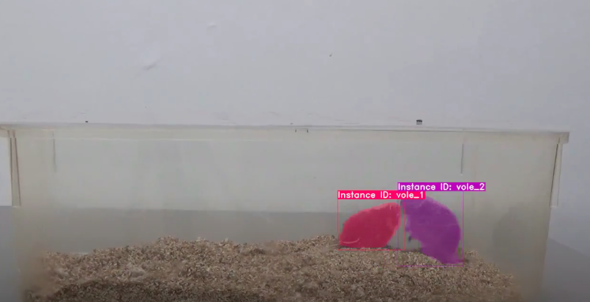
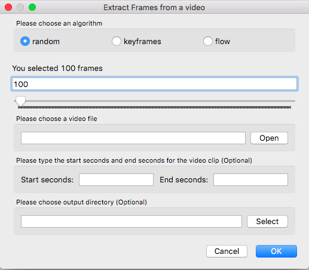
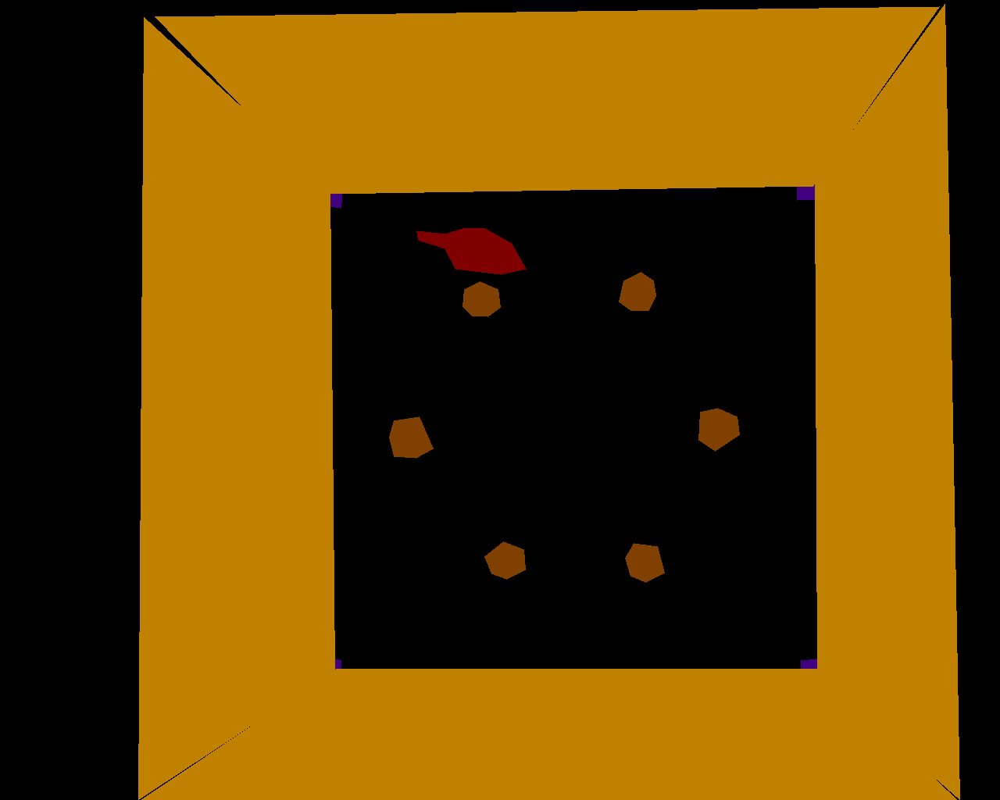
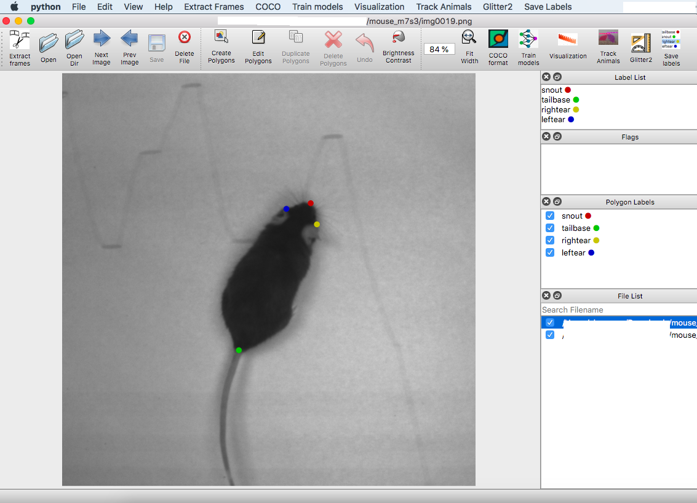

# annolid

[](https://github.com/healthonrails/annolid/actions)
[](https://github.com/healthonrails/annolid/actions)

An annotation and instance segmentation based multiple animal tracking and behavior analysis package.



[](http://www.youtube.com/watch?v=op3A4_LuVj8 "Mouse behavior analysis with instance segmentation based deep learning networks")

## Installation

* Clone the code repo and change into the directory
```bash
git clone --recurse-submodules https://github.com/healthonrails/annolid.git
cd annolid 

# install the package
pip install -e .
```
Note: if you got this error: 
```
ERROR: Could not find a version that satisfies the requirement decord>=0.4.0
```
, please try to install [ffmpeg](https://ffmpeg.org/) and then install decord from source as described [here](https://github.com/dmlc/decord).

## Launch annolid user interface based on labelme
```bash
source activate your_env_name
annolid
#or you can provide a label.txt file as follows.
annolid --labels=/path/to/labels_custom.txt 

```


If you want to learn more about labelme, please check the following link. 

[Read more about annotations](annolid/annotation/labelme.md)

## Extract desired number of frames from a video based on optical flow

```bash
python annolid/main.py -v /path/to/my_video.mp4 --extract_frames=100
```
The above command will extract 100 frames from the provided video and save them to a default folder called extracted_frames in the current annolid repo folder. 

Or you can use the GUI as follows.



## Display optical flow while extracting frames with **--show_flow=True**
```bash
python annolid/main.py -v /path/to/my_video.mp4 --extract_frames=100 --show_flow=True
```

## Save all the frames as images
```bash
python annolid/main.py  -v /path/to/my_video.mp4 --extract_frames=-1
```
## Select frames randomly by reservoir sampling
```bash
python annolid/main.py  -v /path/to/my_video.mp4 --extract_frames=100 --algo=random
```

## Extract all the key frames from a video used by the compression methods
:warning: This method may not work for some videos with certain compression methods. 
```bash
python main.py -v /path/to/my_video.mp4 --algo=keyframes --extract_frames=-1
```

## Threshold based object segmenation
Added track bars for users to select HSV values to 
segment ROIs in the provided video. 
```bash
python annolid/main.py -v /path/to/my_video.mp4 --segmentation=threshold
```


## Convert WMV format to mp4 format using ffmpeg
```bash
ffmpeg -i /path/to/my_video.wmv -c:a aac /path/to/my_video.mp4
```

## Save the extracted frames to a user selected output directory 
If not selected, it will save the extracted frames to a folder named with the video name without extension. For example, if the input video path is /path/to/my_video.mp4, the extracted frames will be saved in the folder /path/to/my_video. 
The output directory is provided, the extracted frames will be saved /path/to/dest/my_video. 
```bash
cd annolid
python main.py -v /path/to/my_video.mp4 --extract_frames=20 --to /path/to/dest --algo=uniform
```

## How to track multiple objects in the video? 
Currently, it just works for person class with pretrained YOLOV3 or YOLOV5 weights.
```bash
python annolid/main.py -v /path/to/my_video.mp4 --track=YOLOV5
```

## How to convert coco annonation format to YOLOV5 format? 
The dataset is structured as follows. 
```
my_yolo_dataset
├── images
│   ├── train
│   └── val
└── labels
    ├── train
    └── val
data.yaml
```
```
python main.py --coco2yolo=/path/to/my_coco_dataset/annotations.json --to my_yolo_dataset --dataset_type=val
```
## How to train a custom YOLOV5 model? 
```bash
cd annolid/detector
cp -r my_yolo_dataset annolid/detector
cd yolov5
# change nc (number of classes) in the models/yolo5x.yaml, default is 80

python train.py --img 640 --batch 8 --epochs 30 --data ../my_dataset_yolo/data.yaml --cfg ./models/yolov5x.yaml --weights yolov5x.pt --name yolov5x_my_model --cache
```

## How to track objects in a video with the trained model? 

```bash
cd annold
python main.py -v /path/to/my_video.mp4 --track=YOLOV5 --weights=detector/yolov5/runs/exp5_yolov5x_my_model/weights/best.pt
```

## How to convert labelme labeled dataset to COCO format? 
:warning: You might need to reinstall annolid because it requires `labelme`
and `pycocotools` now.
```bash
cd annold
python main.py --labelme2coco=/path/to/my_labeled_images --to /path/to/my_dataset_coco --labels=/path/to/my_labels.txt --vis=True
```
If vis is true, it will create an additional visualization folder. 
The dataset is structured as follows. 
```
../../datasets/mydataset_coco/
├── data.yaml
├── train
│   ├── annotations.json
│   └── JPEGImages
│       ├── 00000444.jpg
└── valid
    ├── annotations.json
    └── JPEGImages
        ├── 00000443.jpg
```


An example mask file



## How to train a YOLACT model with a custom dataset? 
Please create a dataset yaml file by using the 
annolid/segementation/yolact/configs/mouse_a4_dataset.yaml as 
an example. 
```
cd annolild/segmentation/yolact
python train.py --config=configs/my_custom_dataset.yaml  --batch_size=8
```
## How to evaluate a video based on a trained model?
```
cd annolid/segmentation/yolact
python eval.py --trained_model=weights/yolact_plus_resnet50_xxx_xxx_xxx_interrupt.pth --score_threshold=0.2 --top_k=4 --video_multiframe=1 --video=my_video.avi:my_result_video.mp4 --mot --config=configs/my_custom_dataset.yaml
```
Note: the output tracking CSV file and video will be saved to 
the folder annolid/segmentation/results. 

## Convert the tracking results csv file to Glitter2 csv format
The result csv file named as tracking_results_nix.csv in the folder as provided in --to option. 
```
python annolid/main.py -v /path/to/my_video.mkv --tracks2glitter /path/to/tracking_results.csv --to /path/to/results_dir/
```

## Convert the keypoint annotations to labelme format
e.g. [DeepLabCut Mouse dataset](https://github.com/DeepLabCut/Primer-MotionCapture/tree/master/mouse_m7s3)

```bash
python annolid/main.py --keypoints2labelme /path/to/mouse_m7s3/  --keypoints /path/to/mouse_m7s3/CollectedData_xxxx.h5 

```
